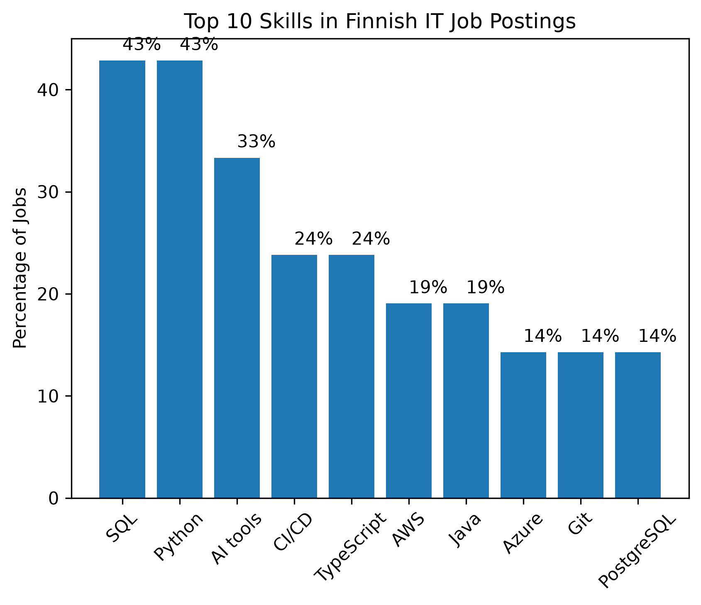
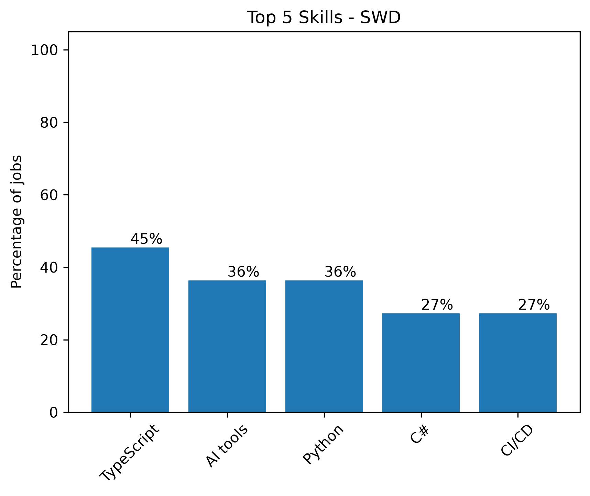
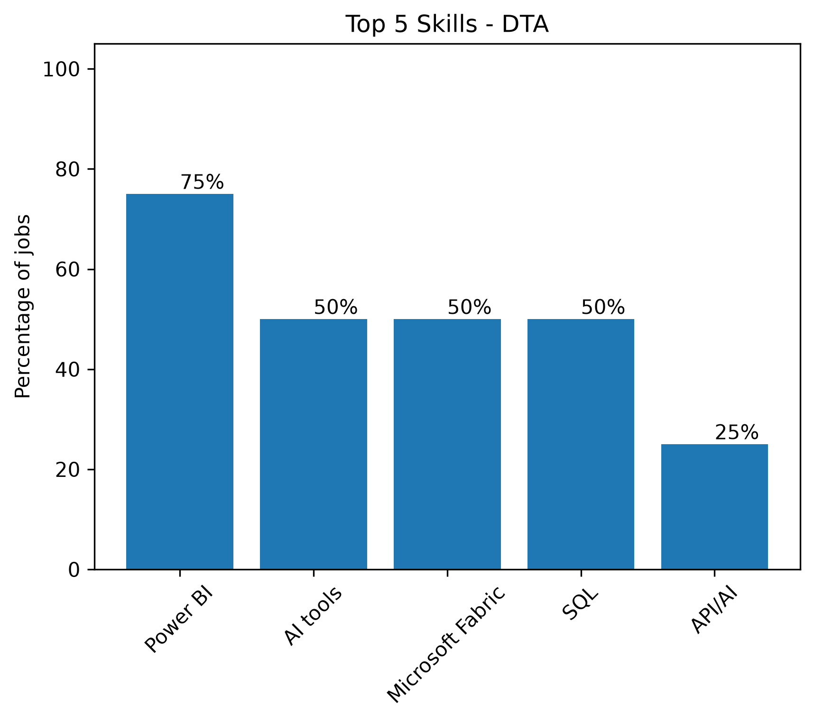
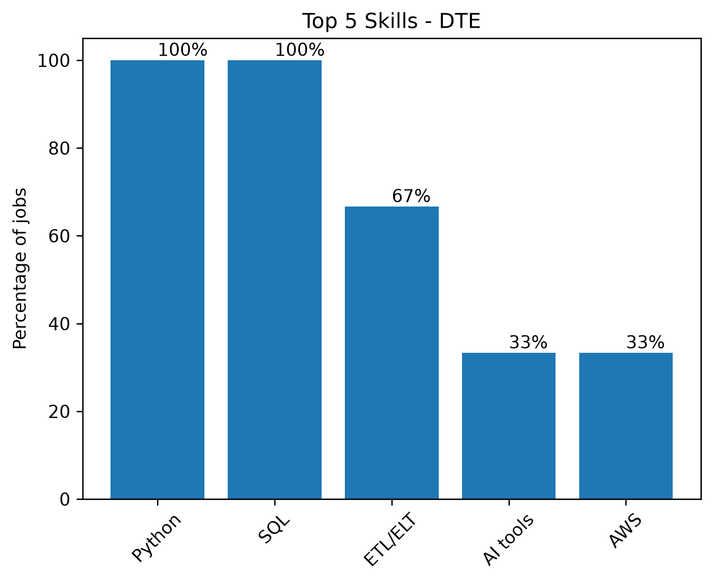
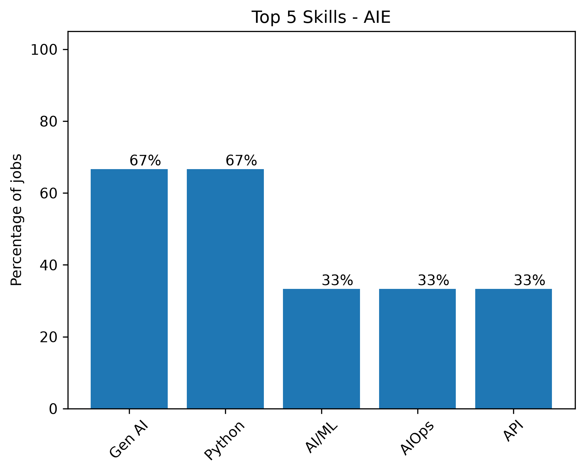
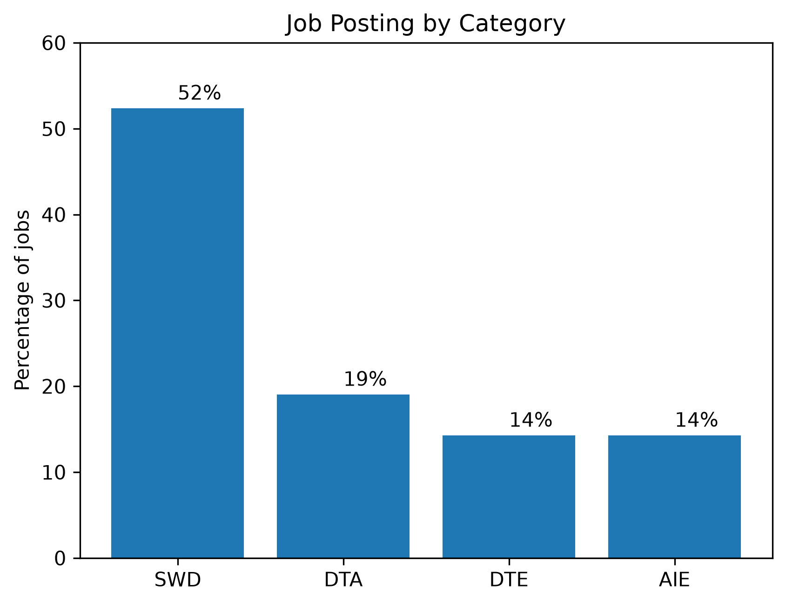
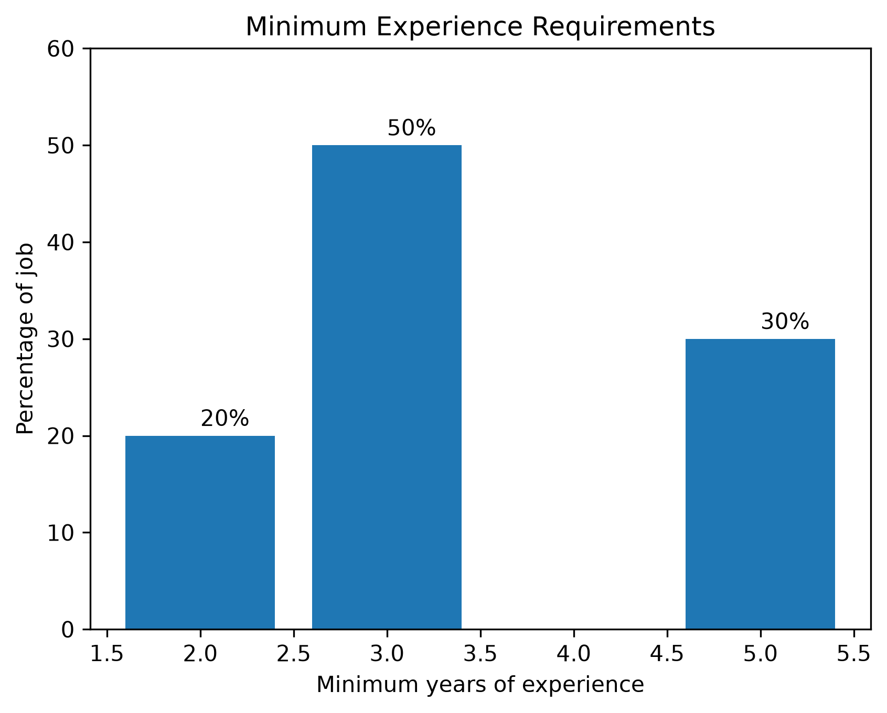
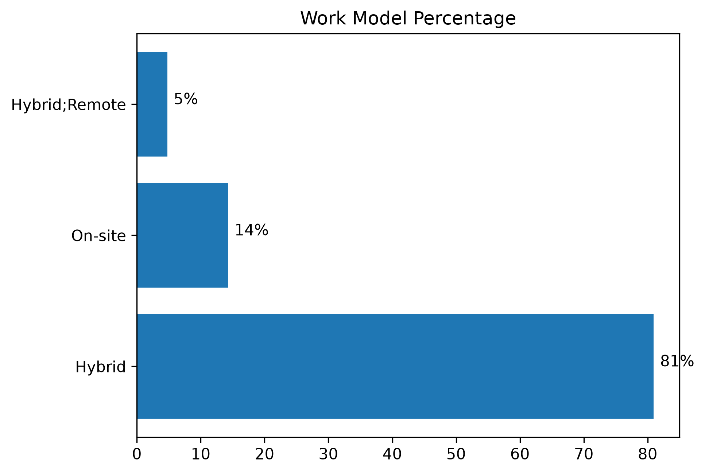

# 🇫🇮 Finnish IT Job Market Analysis

### An exploratory analysis of Finnish IT job postings using Python, Pandas and data visualization.

**Python** · **Pandas** · **NumPy** · **Matplotlib** · **Jupyter** · **Git**

---

## Overview

This project explores Finnish IT job postings to understand the characteristics and technical skill requirements found in the collected sample.

The analysis focuses on:

- Job category distribution
- Technical skill demand
- Skill demand across job categories
- Experience requirements
- Work models

The dataset contains **21 Finnish IT job postings collected from LinkedIn**.

> **Scope:** The results are exploratory and describe the collected sample only. They should not be interpreted as representative of the entire Finnish IT job market.

---

## Key Findings

<table>
<tr>
<td align="center" width="25%">

### 21

Job postings

</td>

<td align="center" width="25%">

### 52%

Software Development

</td>

<td align="center" width="25%">

### 43%

SQL

</td>

<td align="center" width="25%">

### 43%

Python

</td>
</tr>
</table>

### What the analysis found

- **Software Development** represented the largest category, with **11 of 21 postings (52.38%)**.
- **SQL and Python** were the most frequently mentioned skills, each appearing in **9 of 21 postings (42.86%)**.
- Skill requirements varied across job categories. For example, **Power BI** was prominent in Data Analyst postings, while **Python and SQL** were common in Data Engineering postings.
- Among the **10 postings with a specified numerical minimum experience requirement**, **3 years** was the most common requirement (50%).
- **Hybrid** was the dominant recorded work model, accounting for **17 of 21 postings (81%)**.

---

## Skill Analysis

### Top 10 Skills

### Skills by Job Category

The analysis also compares the most frequently mentioned skills within each job category.

<table>
<tr>
<td align="center" width="50%">

**Software Development**

</td>

<td align="center" width="50%">

**Data Analysis**

</td>
</tr>

<tr>
<td align="center" width="50%">

**Data Engineering**

</td>

<td align="center" width="50%">

**AI Engineering**

</td>
</tr>
</table>

### Cross-Category Skills

SQL was the only skill mentioned across all four job categories in the collected sample.

Python, AI tools, CI/CD, AWS and Azure also appeared across multiple categories, showing that several technical skills overlap between different areas of the IT job market.

---

## Market Analysis

The market analysis examines three additional characteristics of the collected postings:

- Job category distribution
- Minimum experience requirements
- Work model distribution

---

## Analysis Notebooks

The project is organized into three analysis stages.

| Notebook                    | Focus                                                                                                   |
| --------------------------- | ------------------------------------------------------------------------------------------------------- |
| `01_data_exploration.ipynb` | Dataset structure, data quality, dates, experience, work models, job categories and initial exploration |
| `02_skill_analysis.ipynb`   | Overall skill frequency, top skills, category-level skills and cross-category skills                    |
| `03_market_analysis.ipynb`  | Job category distribution, experience requirements and work models                                      |

The notebooks follow a consistent analysis structure:

**Question → Method → Code → Result → Interpretation**

---

## Dataset

The dataset contains the following main fields:

- `job_id`
- `job_title`
- `company`
- `location`
- `posted_date`
- `collected_date`
- `years_experience_required`
- `skills`
- `source_website`
- `job_url`
- `work_model`
- `notes`

### Data Preparation

The dataset was prepared for analysis by:

- Cleaning inconsistent values
- Correcting data-entry errors
- Converting date fields
- Extracting minimum and maximum experience requirements
- Classifying job categories
- Cleaning and transforming skill data
- Creating work-model attributes

Skill names were largely preserved as they appeared in the original job postings.

---

## Limitations

This project is based on a small sample of **21 Finnish IT job postings**. The results should therefore be interpreted as exploratory rather than representative of the entire Finnish IT job market.

The number of postings differs between job categories, with Software Development representing the largest group. This uneven distribution affects comparisons between categories.

Experience analysis is based only on postings with a specified numerical minimum experience requirement.

Some skill entries contain grouped alternatives, such as `Azure/AWS` or `SQL, NoSQL`. These were not automatically split because doing so could change the meaning of the original job requirement.

---

## Tools & Technologies

| Tool             | Purpose                             |
| ---------------- | ----------------------------------- |
| Python           | Data analysis                       |
| Pandas           | Data cleaning and analysis          |
| NumPy            | Numerical operations                |
| Matplotlib       | Data visualization                  |
| Jupyter Notebook | Analysis and documentation          |
| Git / GitHub     | Version control and project sharing |

---

## Conclusion

The analysis provides an exploratory view of the Finnish IT job postings collected for this project.

Software Development represented the largest share of the sample, while SQL and Python were the most frequently mentioned technical skills.

The skill analysis also showed substantial overlap between job categories, with several technical skills appearing across multiple areas of the IT market.

Overall, the project demonstrates how job posting data can be cleaned, explored and analyzed with Python to identify patterns in technical skill demand and job market characteristics.

> **Note:** Because the dataset contains only 21 postings, these findings should be viewed as observations from the collected sample rather than general conclusions about the Finnish IT job market.
